# UAS-KRIPTOGRAFI-SEMESTER-5

## 1. Caesar Cipher

merupakan salah satu teknik enkripsi sederhana yang telah digunakan sejak zaman Romawi kuno. Teknik ini dinamakan sesuai dengan Julius Caesar, seorang jenderal Romawi yang terkenal, yang konon digunakan sandi ini untuk berkomunikasi secara aman dengan para jenderalnya.

Prinsip dasar dari Caesar Cipher adalah menggeser setiap huruf dalam teks asli sejumlah langkah tertentu dalam alfabet. Misalnya, jika kita menggunakan pergeseran (shift) sebanyak 3 langkah, huruf A akan digantikan oleh D, huruf B digantikan oleh E, dan seterusnya.
Berikut Screenshot dari program python caesar chiper :
Program :

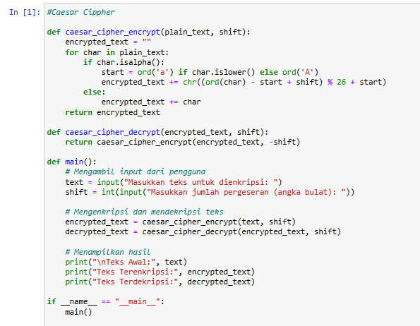

Output:

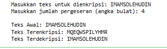

## 2. Vigenre Cipher
Vigenère Cipher adalah metode enkripsi yang lebih kuat daripada Caesar Cipher. Dalam Vigenère Cipher, setiap huruf dalam teks dienkripsi dengan menggunakan pergeseran yang bervariasi, berdasarkan kunci yang bersifat repetitif. Kunci ini digunakan secara berulang dalam proses enkripsi.
Berikut Screenshot dari program python vigenere chiper :
Program :

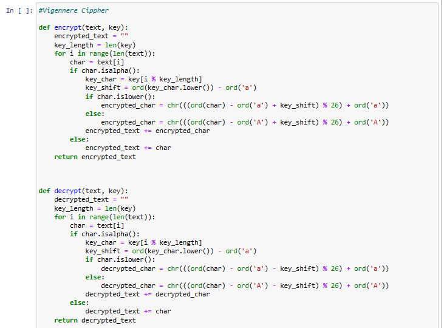

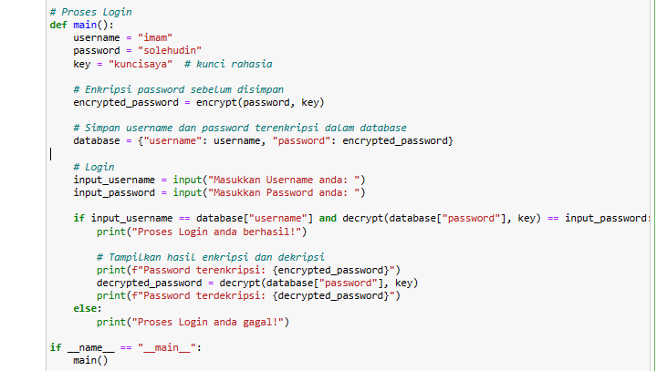

Output :

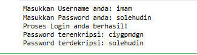

## 3. Poly Alphabet Cipher

Polialfabetik Cipher mengacu pada kelas enkripsi di mana satu huruf dalam teks dapat dienkripsi menjadi beberapa huruf dalam teks terenkripsi, tergantung pada posisi atau kunci tertentu. Vigenère Cipher adalah contoh polialfabetik, di mana penggunaan beberapa alfabet membuatnya lebih sulit dipecahkan.
Berikut Screenshot dari program python polyalphabet chiper :
Program :

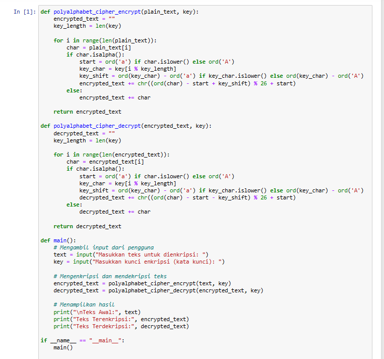

Output :

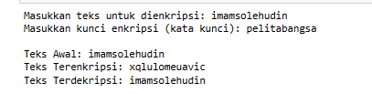

## 4. Hill Cipher

Hill Cipher adalah metode enkripsi yang melibatkan matriks. Setiap blok huruf dalam teks diubah menjadi matriks dan dikalikan dengan matriks kunci untuk menghasilkan teks terenkripsi.
Berikut Screenshot dari program python hill chiper :
Program :

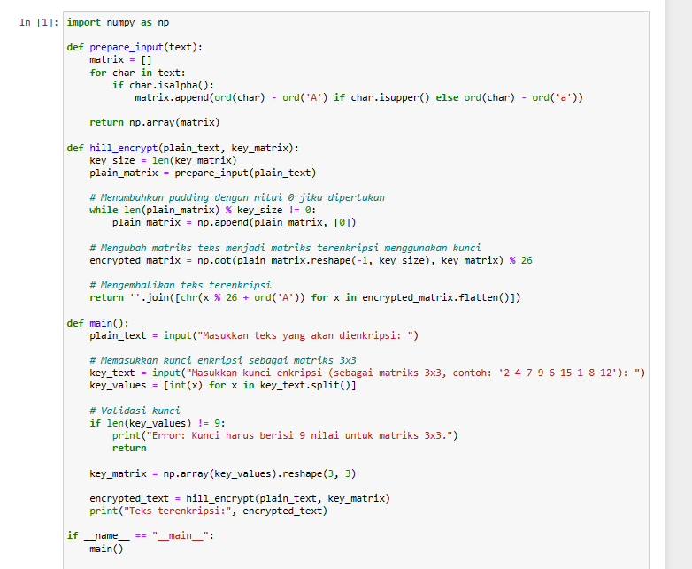

Output :

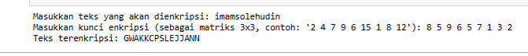

## 5. PlayFair Cipher

Playfair Cipher adalah metode enkripsi n-gram (pasangan huruf). Dua huruf dari pasangan yang sama dalam satu blok diubah menjadi pasangan lain sesuai dengan aturan tertentu. 
Berikut Screenshot dari program python playfair chiper :
Program :

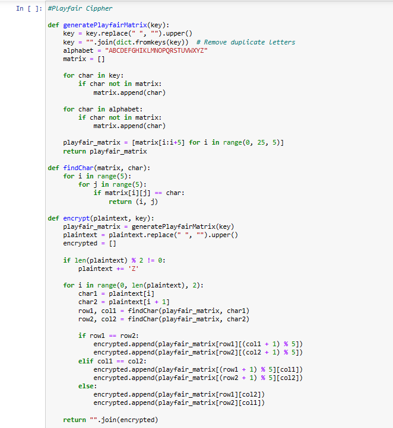

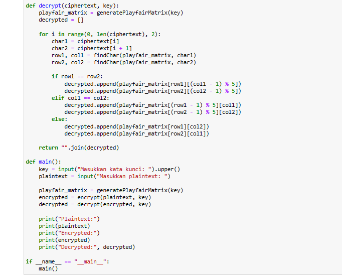

Output :

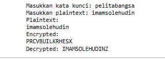

## 6. Affine Cipher

Affine Cipher adalah metode enkripsi linier yang menggabungkan dua fungsi matematika: pertama, menggeser huruf sejumlah tertentu, dan kedua, mengalikan huruf dengan angka tertentu. Metode ini dapat dianggap sebagai pengembangan dari Caesar Cipher dengan peningkatan keamanan.
Berikut Screenshot dari program python affine chiper :
Program :

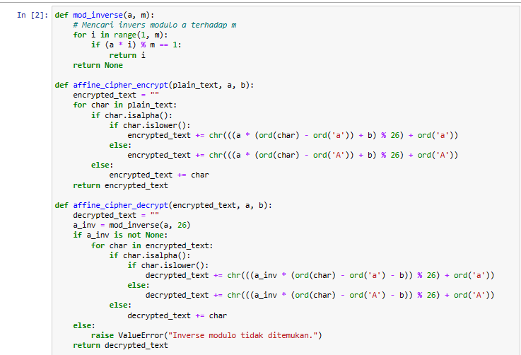

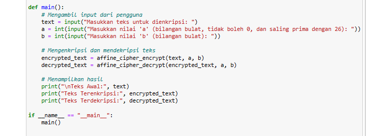

Output :

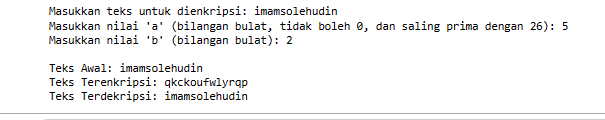

## 7. Affine OTP

Affine OTP adalah kombinasi antara Affine Cipher dan One-Time Pad. One-Time Pad adalah metode enkripsi yang menggunakan kunci acak sepanjang teks, dan ketika digabungkan dengan Affine Cipher, memberikan tingkat keamanan yang sangat tinggi.
Berikut Screenshot dari program python affine otp :
Program :

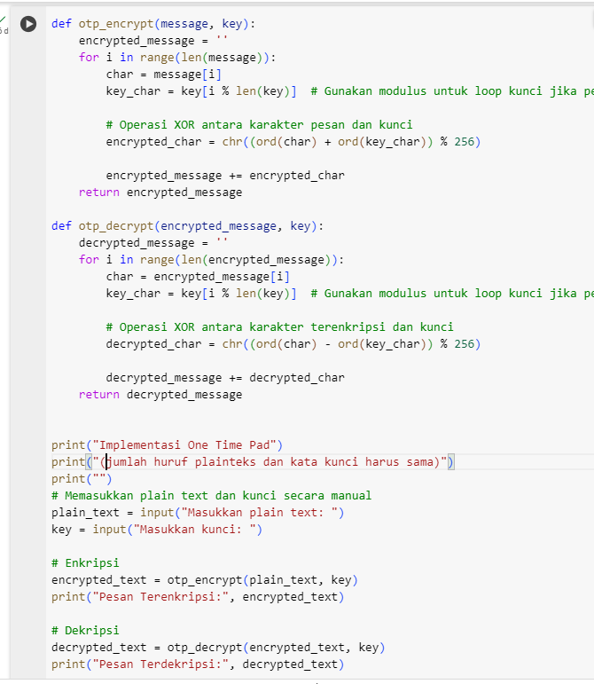

Output :

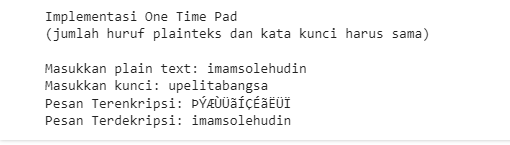

## 8. Steganografi

Steganografi adalah teknik yang digunakan untuk menyembunyikan informasi di dalam media lain, seperti gambar, audio, atau teks. Ini berbeda dengan enkripsi karena tidak hanya melibatkan penyembunyian data, tetapi juga mencoba membuat keberadaan data tersembunyi tersebut tidak terdeteksi. Pada contoh yang akan saya berikan yaitu menyembunyikna teks pada gambar.
Berikut Screenshot dari program python steganografi :
Program :

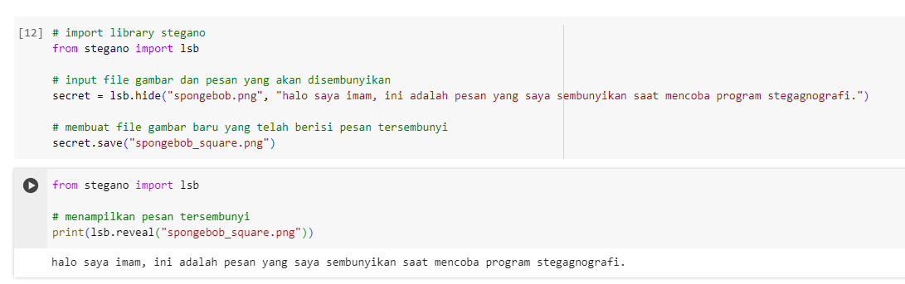

Output :

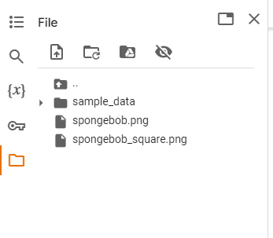

## 9. Pengukuran Nilai Citra

Pengukuran nilai citra berkaitan dengan pengukuran properti atau karakteristik dari citra digital. Ini melibatkan analisis statistik, transformasi, dan ekstraksi fitur untuk mendapatkan informasi yang berguna dari citra, seperti kontrast, kecerahan, atau distribusi warna.
Berikut Screenshot dari program python pengukuran nilai citra :
Program :

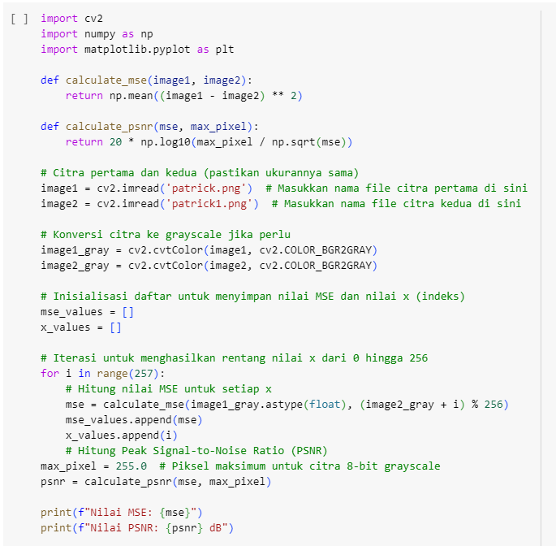

Output :

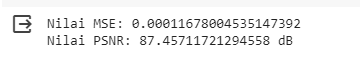
